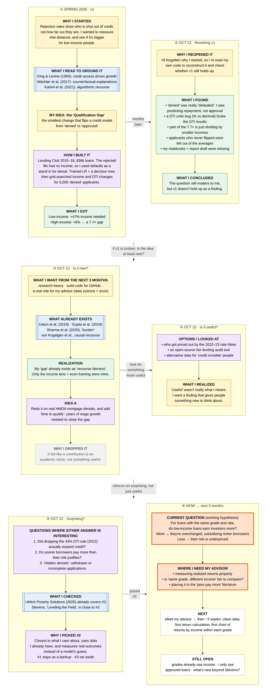

```mermaid
%%{init: {"flowchart": {"wrappingWidth": 420, "nodeSpacing": 25, "rankSpacing": 35, "padding": 10}}}%%
flowchart TB

subgraph ROW1[" "]
  direction LR

  subgraph P0["① SPRING 2026 · v1"]
    direction TB
    A0["<b>WHY I STARTED</b><br/>Rejection rates show who is shut out of credit,<br/>not how far out they are. I wanted to measure<br/>that distance, and see if it's bigger<br/>for low-income people."]
    A1[["<b>WHAT I READ TO GROUND IT</b><br/>King & Levine (1993): credit access drives growth<br/>Wachter et al. (2017): counterfactual explanations<br/>Karimi et al. (2021): algorithmic recourse"]]
    A2["<b>MY IDEA: the 'Qualification Gap'</b><br/>the smallest change that flips a credit model<br/>from 'denied' to 'approved'"]
    A3["<b>HOW I BUILT IT</b><br/>Lending Club 2015–18, 836k loans. The rejected<br/>file had no income, so I used defaults as a<br/>stand-in for denial. Trained LR + a decision tree,<br/>then grid-searched income and DTI changes<br/>for 5,000 'denied' applicants."]
    A4["<b>WHAT I GOT</b><br/>Low-income: +47% income needed<br/>High-income: +6% → a 7.7× gap"]
    A0 --> A1 --> A2 --> A3 --> A4
  end

  subgraph P1["② OCT 22 · Revisiting v1"]
    direction TB
    B0["<b>WHY I REOPENED IT</b><br/>I'd forgotten why I started, so I re-read my<br/>own code to reconstruct it and check<br/>whether v1 still holds up."]
    B1["<b>WHAT I FOUND</b><br/>• 'denied' was really 'defaulted': I was<br/>  predicting repayment, not approval<br/>• a DTI units bug (% vs decimal) broke<br/>  the DTI results<br/>• part of the 7.7× is just dividing by<br/>  smaller incomes<br/>• applicants who never flipped were<br/>  left out of the averages<br/>• my notebooks + report draft were missing"]
    B3["<b>WHAT I CONCLUDED</b><br/>The question still matters to me,<br/>but v1 doesn't hold up as a finding."]
    B0 --> B1 --> B3
  end

  P0 -->|"months<br/>later"| P1
end

subgraph ROW2[" "]
  direction LR

  subgraph P2["③ OCT 22 · Is it new?"]
    direction TB
    C0["<b>WHAT I WANT FROM THE NEXT 3 MONTHS</b><br/>research-heavy · solid code for GitHub ·<br/>a real role for my advisor (data science + econ)"]
    C1[["<b>WHAT ALREADY EXISTS</b><br/>Ustun et al. (2019) · Gupta et al. (2019)<br/>Sharma et al. (2020), 'burden'<br/>von Kügelgen et al., causal recourse"]]
    C2["<b>REALIZATION</b><br/>My 'gap' already exists as 'recourse fairness'.<br/>Only the income lens + econ framing were mine."]
    C3["<b>IDEA A</b><br/>Redo it on real HMDA mortgage denials, and add<br/>'time to qualify': years of wage growth<br/>needed to close the gap"]
    C4["<b>WHY I DROPPED IT</b><br/>It felt like a contribution to an<br/>academic niche, not something useful."]
    C0 --> C1 --> C2 --> C3 --> C4
  end

  subgraph P3["④ OCT 22 · Is it useful?"]
    direction TB
    D0["<b>OPTIONS I LOOKED AT</b><br/>• who got priced out by the 2022–23 rate hikes<br/>• an open-source fair-lending audit tool<br/>• alternative data for 'credit invisible' people"]
    D1["<b>WHAT I REALIZED</b><br/>'Useful' wasn't really what I meant.<br/>I want a finding that gives people<br/>something new to think about."]
    D0 --> D1
  end

  P2 -->|"look for<br/>something<br/>more useful"| P3
end

subgraph ROW3[" "]
  direction LR

  subgraph P4["⑤ OCT 22 · Surprising?"]
    direction TB
    E0["<b>QUESTIONS WHERE EITHER ANSWER IS INTERESTING</b><br/>1. Did dropping the 43% DTI rule (2022)<br/>   actually expand credit?<br/>2. Do poorer borrowers pay more than<br/>   their risk justifies?<br/>3. 'Hidden denials': withdrawn or<br/>   incomplete applications"]
    E1[["<b>WHAT I CHECKED</b><br/>UMich Poverty Solutions (2025) already covers #3<br/>Stevens, 'Leveling the Field', is close to #2"]]
    E2["<b>WHY I PICKED #2</b><br/>Closest to what I care about, uses data<br/>I already have, and measures real outcomes<br/>instead of a model's guess.<br/><i>#1 stays as a backup · #3 set aside</i>"]
    E0 --> E1 --> E2
  end

  subgraph P5["⑥ NOW → next 3 months"]
    direction TB
    F0["<b>CURRENT QUESTION</b> (working hypothesis)<br/>For loans with the same grade and rate,<br/>do low-income loans earn investors more?<br/>More → they're overcharged, subsidizing richer borrowers<br/>Less → their risk is underpriced"]
    F1["<b>WHERE I NEED MY ADVISOR</b><br/>• measuring realized returns properly<br/>• is 'same grade, different income' fair to compare?<br/>• placing it in the 'poor pay more' literature"]
    F2["<b>NEXT</b><br/>Meet my advisor → then ~2 weeks: clean data,<br/>first return calculation, first chart of<br/>returns by income within each grade"]
    F3["<b>STILL OPEN</b><br/>grades already use income · I only see<br/>approved loans · what's new beyond Stevens?"]
    F0 --> F1 --> F2 --> F3
  end

  P4 -->|"picked<br/>#2"| P5
end

ROW1 -->|"if v1 is broken, is the idea at least new?"| ROW2
ROW2 -->|"refocus on surprising, not just useful"| ROW3

classDef idea fill:#FFF4CC,stroke:#B38F00,color:#000
classDef res fill:#E3EEFF,stroke:#2D5BA8,color:#000
classDef find fill:#E6F6EA,stroke:#2E7D32,color:#000
classDef dec fill:#F1E6FF,stroke:#6A3BAA,color:#000
classDef aband fill:#F2F2F2,stroke:#888,color:#555,stroke-dasharray:5 4
classDef cur fill:#FFE1CC,stroke:#D2601A,color:#000,stroke-width:3px
classDef fut fill:#FFFFFF,stroke:#D2601A,color:#000,stroke-dasharray:3 3

class A0,A2,B0,C0,D1 idea
class A1,C1,E1 res
class A4,B1,B3,C2 find
class A3,C3,D0,E0,E2 dec
class C4 aband
class F0,F1 cur
class F2,F3 fut
style ROW1 fill:none,stroke:none
style ROW2 fill:none,stroke:none
style ROW3 fill:none,stroke:none
```
