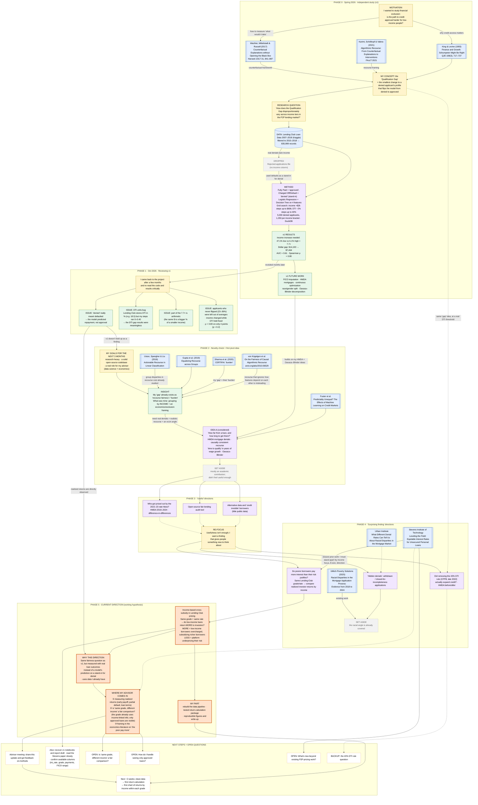

```mermaid
flowchart TD

%% ============ PHASE 0 ============
subgraph P0["PHASE 0 · Spring 2026 · Independent study (v1)"]
  direction TB
  M0["MOTIVATION<br/>I wanted to study financial exclusion:<br/>is the path to credit approval harder for low-income people?"]
  R_KL[["King & Levine (1993)<br/>Finance and Growth: Schumpeter Might Be Right<br/>QJE 108(3), 717–737"]]
  R_W[["Wachter, Mittelstadt & Russell (2017)<br/>Counterfactual Explanations without Opening the Black Box<br/>Harvard JOLT 31, 841–887"]]
  R_K[["Karimi, Schölkopf & Valera (2021)<br/>Algorithmic Recourse: From Counterfactual Explanations to Interventions<br/>FAccT 2021"]]
  CONCEPT["MY CONCEPT: the 'Qualification Gap'<br/>= the smallest change to a denied applicant's profile<br/>that flips the model from denied to approved"]
  RQ["RESEARCH QUESTION<br/>'How does the Qualification Gap disproportionately<br/>vary across income tiers in the P2P lending market?'"]
  DS_LC[("DATA: Lending Club Loan Data 2007–2018 (Kaggle)<br/>filtered to 2015–2018 → 835,999 records")]
  ABAN_REJ["DROPPED<br/>Rejected-applications file<br/>(no income column)"]
  METH["METHOD<br/>Fully Paid = 'approved', Charged Off/Default = 'denied' (stand-in)<br/>Logistic Regression + Decision Tree on 4 features<br/>Grid search: income +$2k steps up to $60k; DTI −2% steps up to 40%<br/>5,000 denied applicants, 1,250 per income bracket · DuckDB"]
  RES0["v1 RESULTS<br/>Income increase needed: 47.1% low vs 6.1% high = 7.7×<br/>Dollar gap: $14,193 → $7,464<br/>AUC ≈ 0.61 · Spearman ρ = 0.80"]
  FW0["v1 FUTURE WORK<br/>FICO imputation · HMDA mortgages · continuous optimization<br/>race/gender split · Oaxaca–Blinder decomposition"]
end

M0 -->|"why credit access matters"| R_KL
M0 -->|"how to measure 'what would it take'"| R_W
R_W -->|"counterfactual framework"| CONCEPT
R_K -->|"recourse framing"| CONCEPT
R_KL --> CONCEPT
CONCEPT --> RQ
RQ --> DS_LC
DS_LC -->|"real denials lack income"| ABAN_REJ
ABAN_REJ -->|"used defaults as a stand-in for denial"| METH
DS_LC --> METH
METH --> RES0
RES0 --> FW0

%% ============ PHASE 1 ============
subgraph P1["PHASE 1 · Oct 2026 · Reviewing v1"]
  direction TB
  U1["I came back to the project after a few months<br/>and re-read the code and results critically"]
  FL1["ISSUE: 'denied' really meant defaulted<br/>→ the model predicted repayment, not approval"]
  FL2["ISSUE: DTI units bug<br/>Lending Club stores DTI in % (e.g. 18.5) but my steps ran 0–0.40<br/>→ the DTI gap results were meaningless"]
  FL3["ISSUE: part of the 7.7× is arithmetic<br/>(the same $ is a bigger % of a smaller income)"]
  FL4["ISSUE: applicants who never flipped (23–36%) were left out of averages<br/>· income changed while DTI held fixed<br/>· ρ = 0.80 on only 4 points (p ≈ 0.2)"]
end

RES0 -->|"revisited months later"| U1
U1 --> FL1
U1 --> FL2
U1 --> FL3
U1 --> FL4

%% ============ PHASE 2 ============
subgraph P2["PHASE 2 · Novelty check + first pivot idea"]
  direction TB
  C1["MY GOALS FOR THE NEXT 3 MONTHS<br/>research-heavy · a solid open-source codebase<br/>· a real role for my advisor (data science + economics)"]
  R_U[["Ustun, Spangher & Liu (2019)<br/>Actionable Recourse in Linear Classification"]]
  R_G[["Gupta et al. (2019)<br/>Equalizing Recourse across Groups"]]
  R_S[["Sharma et al. (2020)<br/>CERTIFAI: 'burden'"]]
  R_VK[["von Kügelgen et al.<br/>On the Fairness of Causal Algorithmic Recourse<br/>arxiv.org/abs/2010.06529"]]
  INS1["INSIGHT<br/>My 'gap' already exists as 'recourse fairness' / 'burden'<br/>What was mine: grouping by INCOME + an economics/exclusion framing"]
  PIV_A["IDEA A (considered)<br/>'How far from a loan, and how long to get there?'<br/>HMDA mortgage denials · causally consistent recourse<br/>'time to qualify' in years of wage growth · Oaxaca–Blinder"]
  R_F[["Fuster et al.<br/>Predictably Unequal? The Effects of Machine Learning on Credit Markets"]]
  ABAN_A["SET ASIDE<br/>mostly an academic contribution;<br/>didn't feel useful enough"]
end

FL1 -->|"v1 doesn't hold up as a finding"| C1
C1 --> INS1
R_U -->|"group disparities in recourse cost already studied"| INS1
R_G --> INS1
R_S -->|"my 'gap' = their 'burden'"| INS1
R_VK -->|"recourse that ignores how features depend on each other is misleading"| INS1
INS1 -->|"need real denials + realistic recourse + an econ angle"| PIV_A
FW0 -->|"builds on my HMDA + Oaxaca–Blinder ideas"| PIV_A
R_F --> PIV_A
PIV_A --> ABAN_A

%% ============ PHASE 3 ============
subgraph P3["PHASE 3 · 'Useful' directions"]
  direction TB
  O1["Who got priced out by the 2022–23 rate hikes?<br/>HMDA 2018–2024 · difference-in-differences"]
  O2["Open-source fair-lending audit tool"]
  O3["Alternative data and 'credit invisible' borrowers<br/>(little public data)"]
  REDIR["RE-FOCUS<br/>Usefulness isn't enough; I want a finding<br/>that gives people something new to think about"]
end

ABAN_A --> O1
ABAN_A --> O2
ABAN_A --> O3
O1 -.-> REDIR
O2 -.-> REDIR
O3 -.-> REDIR

%% ============ PHASE 4 ============
subgraph P4["PHASE 4 · 'Surprising finding' directions"]
  direction TB
  S1["Did removing the 43% DTI rule (CFPB, late 2022)<br/>actually expand credit? · HMDA before/after"]
  S2["Do poorer borrowers pay more interest than their risk justifies?<br/>Same Lending Club grade/rate → compare realized investor returns by income"]
  S3["'Hidden denials': withdrawn / closed-for-incompleteness applications"]
  R_UM[["UMich Poverty Solutions (2025)<br/>Racial Disparities in the Mortgage Application Process:<br/>Evidence from 2018 to 2024"]]
  R_URB[["Urban Institute<br/>What Different Denial Rates Can Tell Us<br/>About Racial Disparities in the Mortgage Market"]]
  R_STV[["Stevens Institute of Technology<br/>Leveling the Field: Equitable Interest Rates<br/>for Unsecured Personal Loans"]]
  ABAN_S3["SET ASIDE<br/>the racial angle is already covered"]
end

REDIR --> S1
REDIR --> S2
REDIR --> S3
R_UM -->|"existing work"| ABAN_S3
R_URB -.-> S3
S3 --> ABAN_S3
R_STV -->|"closest prior work: I must stand apart by income focus, $ size, direction"| S2
CONCEPT -.->|"same 'gap' idea, at a real DTI threshold"| S1

%% ============ PHASE 5 ============
subgraph P5["PHASE 5 · CURRENT DIRECTION (working hypothesis)"]
  direction TB
  CUR["Income-based cross-subsidy in Lending Club pricing<br/>Same grade + same rate → do low-income loans return MORE to investors?<br/>MORE = low-income borrowers overcharged, subsidizing richer borrowers<br/>LESS = platform underpricing their risk"]
  WHY["WHY THIS DIRECTION<br/>Same fairness question as v1, but measured with real loan outcomes<br/>instead of a model's prediction on a stand-in for denial<br/>· uses data I already have"]
  PROF["WHERE MY ADVISOR COMES IN<br/>① measuring realized returns (early payoff, partial default, loan terms)<br/>② is 'same grade, different income' a fair comparison?<br/>(the grade already uses income-linked info; only approved loans are visible)<br/>③ framing in the economics literature on 'the poor pay more'"]
  ME["MY PART<br/>rebuild the data pipeline · tested return-calculation package<br/>· reproducible figures and write-up"]
end

S2 --> CUR
FL1 -->|"realized returns are directly observed"| WHY
CUR --> WHY
WHY --> PROF
CUR --> ME
R_STV -.-> PROF

%% ============ PHASE 6 ============
subgraph P6["NEXT STEPS + OPEN QUESTIONS"]
  direction TB
  N0["Advisor meeting: share this update and get feedback on methods"]
  N1["Next ~2 weeks: clean data → first return calculation<br/>→ first chart of returns by income within each grade"]
  L1["Also: recover v1 notebooks and report draft · read the Stevens paper closely<br/>· confirm available columns (int_rate, grade, payments, FICO range)"]
  Q1["OPEN: Is 'same grade, different income' a fair comparison?"]
  Q2["OPEN: How do I handle seeing only approved loans?"]
  Q3["OPEN: What's new beyond existing P2P-pricing work?"]
  Q4["BACKUP: the 43% DTI rule question"]
end

PROF --> N0
N0 --> N1
ME --> N1
CUR --> L1
PROF --> Q1
PROF --> Q2
R_STV --> Q3
S1 -.-> Q4

%% ============ STYLES ============
classDef idea fill:#FFF4CC,stroke:#B38F00,color:#000
classDef res fill:#E3EEFF,stroke:#2D5BA8,color:#000
classDef find fill:#E6F6EA,stroke:#2E7D32,color:#000
classDef dec fill:#F1E6FF,stroke:#6A3BAA,color:#000
classDef aband fill:#F2F2F2,stroke:#888,color:#555,stroke-dasharray:5 4
classDef cur fill:#FFE1CC,stroke:#D2601A,color:#000,stroke-width:3px
classDef fut fill:#FFFFFF,stroke:#D2601A,color:#000,stroke-dasharray:3 3

class M0,CONCEPT,RQ,U1,C1,REDIR idea
class R_KL,R_W,R_K,R_U,R_G,R_S,R_VK,R_F,R_UM,R_URB,R_STV,DS_LC res
class RES0,FW0,FL1,FL2,FL3,FL4,INS1 find
class METH,PIV_A,O1,O2,O3,S1,S2,S3 dec
class ABAN_REJ,ABAN_A,ABAN_S3 aband
class CUR,WHY,PROF,ME cur
class N0,N1,L1,Q1,Q2,Q3,Q4 fut
```
